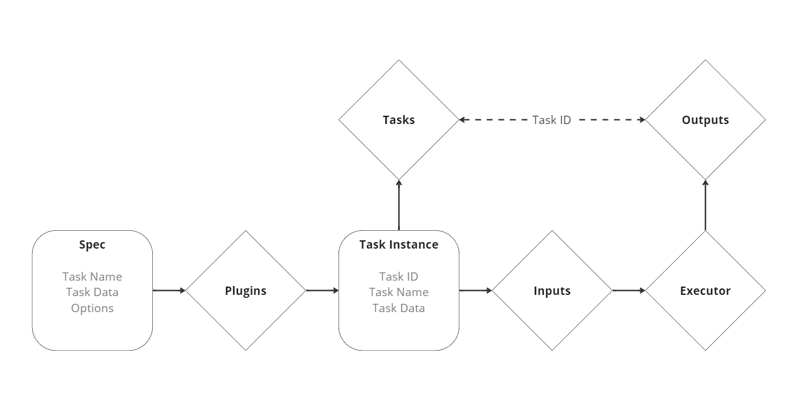

# Kantoku

A platform for distributed task execution

# Kantoku Framework Components

# Kernel Task Pipeline

# Roadmap
- [ ] Task Dependencies
  - A dependency based scheduler
- [ ] Generalized Services
  - Common service structure for different types of processors
    - We need a single package that would take care of running and gracefully shutting down
      all types of processors
  - Cross-session service identification
    - Each service instance must have its persistent ID that can be used as a consumer group label for queues.
  - Service discovery
    - We need to collect information about services (their presence, id, other properties)
- [ ] Functional Tasks
  - It should be possible to describe tasks as Go/(Other language) functions
- [ ] Context
  - Tasks should be grouped by contexts
- [ ] Pipelines
  - A convenient way to compose tasks
- [ ] Make everything transactional (via SAGAs)

### Links

[Jira](https://r-ischenko.atlassian.net/jira/software/projects/KAN/boards/1)

[Miro](https://miro.com/app/board/uXjVNS1PReQ=/)
